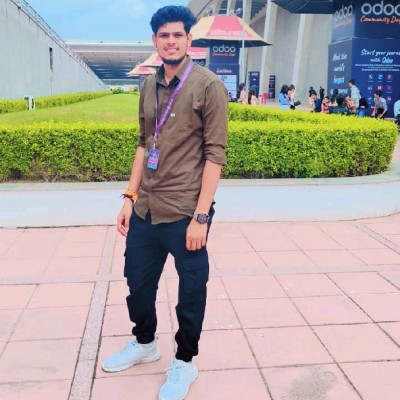

# Hi 👋 I'm Bhushan Wagh

### 🚀 Odoo Software Engineer | ERP Developer | Full-Stack Developer

---

## 👨‍💻 About Me

I am an **Odoo Software Engineer** with strong experience in developing and customizing ERP solutions that help businesses automate processes and improve efficiency.

My core expertise is in **Python development and Odoo ERP**, along with strong knowledge of databases, backend architecture, and system integrations.

I work across the **full development stack**, building backend systems, APIs, and integrations using **Python, REST APIs, and GraphQL**, while also developing user-friendly interfaces using **JavaScript, HTML, CSS, and Bootstrap**.

Along with technical development, I also work as an **Odoo Consultant**, helping businesses understand their requirements and implementing practical ERP solutions.

---

## 🛠 Tech Stack

Python | Odoo | PostgreSQL | REST API | GraphQL  
JavaScript | HTML | CSS | Bootstrap | Java

---

## 📊 GitHub Stats

---

## 🔥 GitHub Streak

---

⭐ Always learning, building, and improving.
